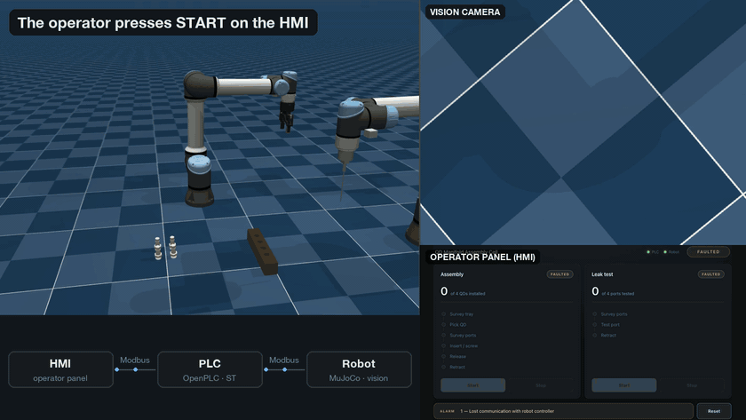

# UR5 QD Assembly & Leak Test Cell — HMI ⇄ PLC ⇄ Robot over Modbus

<p align="center"></p>
<p align="center"><sub>One real run at normal speed: START on the HMI, one QD found, picked and screwed in, one leak test - with every PLC gate request and permit shown as it crosses Modbus. <a href="docs/demo.mp4">Sharper MP4</a></sub></p>

A simulated industrial work cell. A UR5e picks four quick-disconnect fittings out of a
tray and screws each one into its own manifold port; a second arm then traces the seam
of every installed flange to leak-test it. The robot finds the parts by looking at them
— its own wrist camera, plain OpenCV shape detection, no motion-capture ground truth at
runtime.

What makes it a *cell* rather than a simulation is everything around the robot. A real
PLC — [OpenPLC](https://autonomylogic.com/) running IEC 61131-3 Structured Text in
Docker — supervises the whole session over Modbus TCP, and a browser operator panel
drives the PLC over a second Modbus link. The robot cannot move until the PLC permits
it, and the PLC will not permit it until an operator presses a button.

## The one thing worth knowing

**Click START in the browser and the robot starts moving.** That button press travels:

```
browser ──HTTP──▶ panel server ──Modbus TCP──▶ OpenPLC (Structured Text) ──Modbus TCP──▶ robot
```

No shortcuts in between. The panel writes a coil on the PLC; the PLC's own ST program
edge-detects it, checks its interlocks, and grants a permit to the gate the robot is
parked at; the robot's gate sees the permit and releases. Every status lamp on the panel
is a real register the PLC actually computed.

## Mapping to real cell hardware

| This project | Real equivalent |
|---|---|
| MuJoCo sim + its internal motion/vision code | Robot controller (a UR control box) |
| The sim's Modbus TCP slave | Robot controller's fieldbus interface |
| OpenPLC running Structured Text | The cell PLC (CompactLogix, S7-1200, …) |
| Browser operator panel | Operator panel (PanelView, Comfort Panel) |
| The OpenCV live window | Vision system's own display (Cognex, Keyence) |

The vision display is a separate window from the operator panel, as it is on a real floor:
the panel carries control and status, and the vision controller has its own screen.

## Setup

```bash
python3 -m venv venv
source venv/bin/activate
pip install -r requirements.txt
```

Built against Python 3.14 and MuJoCo 3.12. The composed scene and every mesh it needs are
checked into `scene/`, so nothing needs building. `scene/meshes/parts/` holds the three
CAD parts the cell actually works on — the quick-disconnect, the manifold and the leak
probe; `scene/meshes/robot/` holds the arm and gripper meshes.

The PLC needs [Docker Desktop](https://www.docker.com/products/docker-desktop/). The
first `start_cell.sh` builds the OpenPLC image from source, which takes several minutes
once; after that the container starts in seconds. The image is built **from source**
rather than pulled, so the runtime is native arm64 — an emulated x86 build adds scan
jitter that reads as a Modbus bug.

OpenPLC then needs configuring once — the Modbus server and the slave-device table that
points it at the robot. That is covered step by step in
[`docs/OPENPLC_SETUP.md`](docs/OPENPLC_SETUP.md), and `scripts/plc_configure.py` can do
it for you with the block sizes taken straight from `qd_plc/tags.py`.

## Running it

One command brings the whole cell up, in the right order, skipping anything already
running:

```bash
./scripts/start_cell.sh
```

That starts the PLC container, the operator panel on `http://localhost:8000`, and the
robot — which loads the scene, parks at gate G0, and waits. Your browser opens on the
panel. Press **Start**.

```bash
./scripts/start_cell.sh --headless     # no OpenCV window
./scripts/start_cell.sh --no-browser   # don't open the browser
./scripts/stop_cell.sh                 # stop the robot and the panel
./scripts/stop_cell.sh --all           # also stop the PLC container
```

A full session is 4 QDs installed, then 4 leak tests, about 12 minutes. Each launch
records itself to its own `out/cell_run_<timestamp>.mp4` as it goes — the robot process
is relaunched on every Reset, and a fixed filename would mean each reset destroying the
recording of the run before it.

### Recording a video without the PLC

The session runs standalone too, with no PLC and no panel:

```bash
venv/bin/python scripts/run_cell.py --out out/full_session.mp4
```

Add `--live` for the interactive window with its own START button, and `--live-out` to
record that window — both halves, overlays and telemetry — to its own file. That is what
the preview above is.

## The operator panel

Two columns, one per phase of the session, each with its own Start and Stop:

```
┌─ QD Manifold Assembly Cell ──────────── ● PLC  ● Robot ── RUNNING ─┐
│                                                                    │
│  Assembly              RUNNING  │  Leak test                 IDLE  │
│  2 of 4 QDs installed           │  0 of 4 ports tested             │
│                                 │                                  │
│  ○ Survey tray                  │  ○ Survey ports                  │
│  ○ Pick QD                      │  ○ Test port                     │
│  ○ Survey ports                 │  ○ Retract                       │
│  ● Insert / screw               │                                  │
│  ○ Release                      │                                  │
│  ○ Retract                      │                                  │
│                                 │                                  │
│  [ Start ]  [ Stop ]            │  [ Start ]  [ Stop ]             │
├────────────────────────────────────────────────────────────────────┤
│  ALARM  — none —                                          [ Reset ] │
└────────────────────────────────────────────────────────────────────┘
```

Every step in those lists is a phase the supervisor can actually observe. A step nothing
publishes would be a step that never lights, so the two lists are built from the phase
codes themselves rather than written out by hand.

- **Stop** stops the robot where it stands, mid-motion. Nothing is stepped while held, so
  position and velocity are preserved untouched and **Start** resumes the same trajectory
  rather than restarting it — a freeze frame, not a stop.
- **Reset** is available at any time. It aborts the running session and relaunches the
  robot process, which reloads the scene from its keyframe: QDs back on the tray,
  manifold empty, arms home.
- The leak phase needs its own Start, and its gate additionally requires all four QDs to
  be installed — so arming it early is allowed, and simply queues it behind the assembly.
- After a finished session the cell sits in COMPLETE. The first Start (or Reset)
  acknowledges that and returns it to IDLE; the next one runs the new session — the same
  acknowledge-then-start most cells ask for at the end of a part.
- The live window has an **EXIT** button that takes the whole cell down cleanly.

## How the handshake works

The robot free-runs far faster than the PLC's ~100 ms poll — a whole phase can elapse
between two scans. Three things make that safe:

- **Gates.** The robot stops at twelve points and waits for a permit. A gated robot
  physically cannot outrun its supervisor. Gates sit only where motion has already come
  to rest, never inside a loose handoff.
- **Sticky status bits.** Anything the PLC must not miss — a vision fallback, a
  self-collision, a phase that hit its step cap — is set-only in the robot and cleared
  only by the PLC's `CLEAR_STICKY` coil. The robot cannot hide a condition the supervisor
  has not yet seen.
- **A monotonic `PHASE_SEQ`.** A permit must match both the phase code *and* its sequence
  number, so a `PERMIT` left high from the previous phase is harmless rather than a
  silent double-release.

The interlock that matters most is **G5**: the supervisor decides the part is seated deep
enough before the gripper is allowed to let go. It lands exactly on the window where the
code already holds the arm completely still after screwing, so waiting there costs
nothing and disturbs nothing.

**The robot reports; the PLC judges.** The robot publishes `TILT_DEG = 51`; the PLC
decides whether 0.51° is within limits. No threshold lives on the robot side. That split
is what lets the whole supervisor be fault-tested with no physics engine running at all.

## Layout

```
qd_sim/              the robot
  robot/             arm controller, damped-least-squares IK, kinematics
  vision/            shape detection, ray-casting, seam-path geometry
  tasks/             pick, transport, kinematic weld, leak test
  control/           screw controller, state machine
  env.py             loading the scene and stepping physics
  transforms.py      quaternion and pose maths
  live_dashboard.py  the vision-system window
qd_plc/              the supervisor
  tags.py            SINGLE SOURCE OF TRUTH for both register maps
  server.py          the robot's Modbus TCP slave
  gate.py            the gate-permit handshake
  signals.py         robot values -> Map A registers
  datastore.py       the register file behind the slave, with sticky bits
  hmi/               the operator panel (HTTP + Modbus client + static files)
qd_cell/             the session that drives the robot through the gates
  constants.py       every tuning constant, in one file
  session.py         CellSession: setup, tick, motion, vision, display, session
plc/
  st/                cell_control.st - the Structured Text the PLC actually runs
  Dockerfile         OpenPLC, built from source for a native arm64 runtime
scripts/             start_cell.sh, run_cell.py, and the PLC tooling
scene/               the composed MJCF scene
  meshes/parts/      the QD, the manifold and the probe
  meshes/robot/      the UR5e and Robotiq meshes the arms are built from
docs/                architecture, OpenPLC setup, generated tag map
```

`qd_plc/tags.py` is the single definition of both register maps. It generates the OpenPLC
slave-device table, the ST `VAR` declarations (`plc/st/tags_generated.st`) and
`docs/PLC_TAGS.md`, so the three cannot drift apart — regenerate with
`scripts/gen_plc_docs.py` after any change to a map.

## Documentation

| | |
|---|---|
| [`docs/ARCHITECTURE.md`](docs/ARCHITECTURE.md) | The supervisory layer: both register maps, the twelve gates, the fault table, the hardware mapping |
| [`docs/OPENPLC_SETUP.md`](docs/OPENPLC_SETUP.md) | **Read this first** — the one-time OpenPLC configuration, without which the cell will not run |
| [`docs/PLC_TAGS.md`](docs/PLC_TAGS.md) | Every tag, address, scale and enum — generated from `qd_plc/tags.py` |

## Credits

The UR5e arm and Robotiq 2F-85 gripper models, and their meshes in `scene/meshes/robot/`,
come from Google DeepMind's [MuJoCo Menagerie](https://github.com/google-deepmind/mujoco_menagerie):

- **UR5e** — Copyright 2018 ROS Industrial Consortium, BSD-3-Clause
  ([`LICENSE-UR5e`](scene/meshes/robot/LICENSE-UR5e))
- **Robotiq 2F-85** — Copyright 2013 ROS-Industrial, BSD-2-Clause
  ([`LICENSE-Robotiq-2F85`](scene/meshes/robot/LICENSE-Robotiq-2F85))

This project composes them into one scene and adds the screw adapter, the wrist camera, the
leak-test probe and everything around them.
